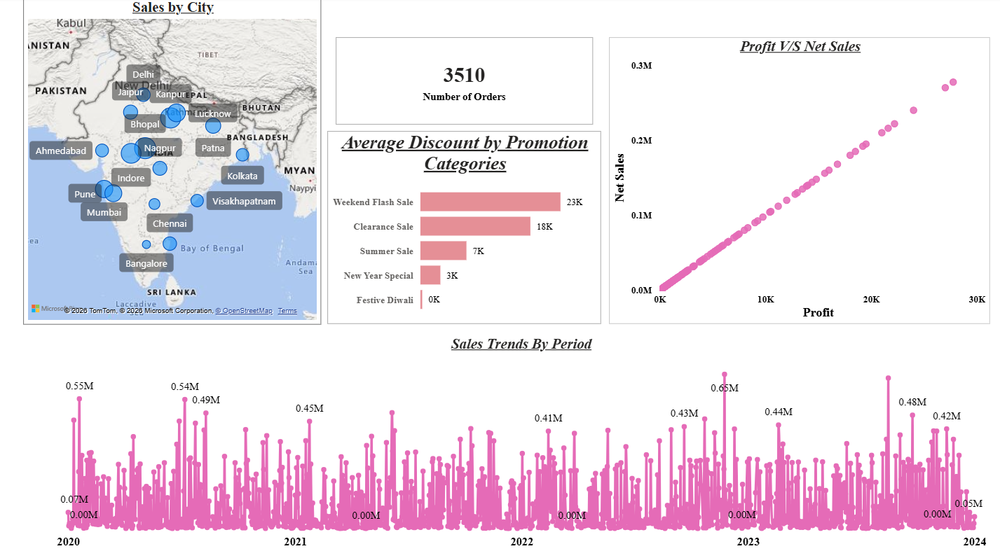
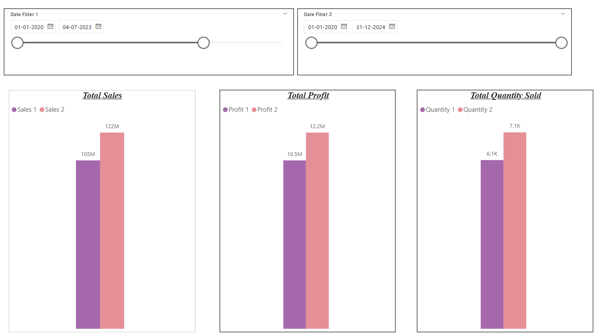

# 🛒 ElectroHub - Power BI Sales Analytics Dashboard

A comprehensive retail sales analytics dashboard built in Power BI for **ElectroHub**, a multi-category store selling Electronics, Footwear, Clothing, Home Appliances, Accessories, Kitchenware, Bags, and Personal Care products.

---

## 📋 Project Overview

This project analyzes transactional sales data to surface key business insights including revenue trends, product performance, customer behavior, discount effectiveness, and geographic distribution — all through an interactive Power BI report.

---

## 📁 File Structure

```
ElectroHub/
├── Electrohub.pbix                        # Main Power BI report file
├── Store_Data.xlsx                        # Source data (3 sheets)
│   ├── Dim Customers                      # 50 customers with city/state info
│   ├── Dim Product                        # 30 products across 8 categories
│   ├── Dim Promotion                      # 5 promotion types
│   └── Sheet3 (Fact Sales)               # Transaction-level sales records
└── Power_BI_Project_1_Requirements.pptx  # Original project requirements
```

---

## 🖼️ Screenshots

### Page 1 - Overview


### Page 2 - Top/Bottom 5 Analysis


### Page 3 - Comparison (Sales / Profit / Quantity)


### Page 4 - Edit Interactions (Period Comparison)


### Page 5 - Table Visual (Fact Table Detail)


---

## 🗃️ Data Model

### Tables

| Table | Type | Description |
|---|---|---|
| `Dim Customers` | Dimension | Customer ID, Name, City, State, Pincode, Email, Phone |
| `Dim Product` | Dimension | Product ID, Name, Product Line, Price (INR) |
| `Dim Promotion` | Dimension | Promotion ID, Name, Ad Type, Coupon Code, Discount Type |
| `Sheet3` (Fact Sales) | Fact | Date, CustomerID, PromotionID, ProductID, Units Sold, Price Per Unit, Total Sales, Discount %, Discount Value, Net Sales |

### Relationships
- `Fact Sales[CustomerID]` → `Dim Customers[Customer ID]`
- `Fact Sales[Product ID]` → `Dim Product[ProductID]`
- `Fact Sales[PromotionID]` → `Dim Promotion[PromotionID]`

---

## 📊 Dashboard Pages & Visuals

### Page 1 - Overview
- Executive-level summary of the entire store's performance
- Key KPIs: Total Sales, Total Profit, Total Orders, Net Sales, Avg Discount
- High-level snapshot designed for quick decision-making

### Page 2 - Top/Bottom 5 Analysis
- **Top & Bottom 5 Products** ranked by Sales, Profit, and Quantity Sold
- Identify best-sellers and underperformers across all 8 product categories
- Helps prioritize inventory, marketing, and promotional focus

### Page 3 - Comparison (Sales / Profit / Quantity)
- Side-by-side comparison of Sales, Profit, and Quantity Sold across products, categories, or time periods
- Visualizes relationships and performance gaps between metrics

### Page 4 - Edit Interactions (Period Comparison)
- User-driven comparison tool — select **any two time periods** and compare their Sales side by side
- Built using Power BI's Edit Interactions feature with dynamic slicers
- Enables flexible, ad-hoc analysis without any fixed date filters

### Page 5 - Table Visual (Fact Table Detail)
- Full granular view of the underlying **Fact Sales table**
- Columns: Date, Customer, Product, Promotion, Units Sold, Price Per Unit, Total Sales, Discount %, Discount Value, Net Sales
- Filterable by **Product, Date, Customer ID, and Promotion Category** using visual-level filters

---

## 🛍️ Product Categories

| Category | Example Products |
|---|---|
| Electronics | Apple iPhone 14, Samsung Galaxy S21, HP Pavilion Laptop |
| Home Appliances | LG Washing Machine, Philips Air Fryer, Bajaj Mixer Grinder |
| Clothing | Levi's Jeans, Raymond Suit, Zara Casual Shirt |
| Footwear | Nike Running Shoes, Adidas Sneakers, Puma Sports Shoes |
| Accessories | Titan Wrist Watch, Fossil Smartwatch |
| Kitchenware | Tupperware Lunch Box, Borosil Glass Set |
| Bags | American Tourister Suitcase, Puma Backpack |
| Personal Care | L'Oreal Shampoo, Nivea Body Lotion, Colgate Toothpaste |

---

## 🎯 Promotions

| Promotion | Ad Channel | Discount |
|---|---|---|
| Summer Sale | Email | 20% off |
| Festive Diwali | Social Media | 10% off |
| New Year Special | Website Banner | Buy 1 Get 1 Free |
| Weekend Flash Sale | Mobile Push | 50% off |
| Clearance Sale | In-App | 70% off |

---

## ⚙️ How to Use

1. Open `Electrohub.pbix` in **Power BI Desktop** (version 2.0 or later recommended)
2. If prompted, re-link `Store_Data.xlsx` via **Transform Data → Data Source Settings**
3. Navigate between report pages using the tab bar at the bottom
4. Use slicers to filter by **Product, Date Range, Customer, or Promotion Category**
5. Use the **Period Comparison** page to benchmark any two custom time windows

---

## 🔧 Requirements

- Power BI Desktop (free download from [Microsoft](https://powerbi.microsoft.com/desktop/))
- Microsoft Excel (to view/edit source data)
- No additional connectors or gateways required — all data is file-based

---

## 👤 Author

**Amit Yadav**

Built as part of a Power BI learning project covering real-world retail analytics scenarios.

[](https://www.linkedin.com/in/amit-y-3408a2308)

---

## 📄 License

MIT License

Copyright (c) 2025 Amit Yadav

Permission is hereby granted, free of charge, to any person obtaining a copy
of this software and associated documentation files (the "Software"), to deal
in the Software without restriction, including without limitation the rights
to use, copy, modify, merge, publish, distribute, sublicense, and/or sell
copies of the Software, and to permit persons to whom the Software is
furnished to do so, subject to the following conditions:

The above copyright notice and this permission notice shall be included in all
copies or substantial portions of the Software.

THE SOFTWARE IS PROVIDED "AS IS", WITHOUT WARRANTY OF ANY KIND, EXPRESS OR
IMPLIED, INCLUDING BUT NOT LIMITED TO THE WARRANTIES OF MERCHANTABILITY,
FITNESS FOR A PARTICULAR PURPOSE AND NONINFRINGEMENT. IN NO EVENT SHALL THE
AUTHORS OR COPYRIGHT HOLDERS BE LIABLE FOR ANY CLAIM, DAMAGES OR OTHER
LIABILITY, WHETHER IN AN ACTION OF CONTRACT, TORT OR OTHERWISE, ARISING FROM,
OUT OF OR IN CONNECTION WITH THE SOFTWARE OR THE USE OR OTHER DEALINGS IN THE
SOFTWARE.

---

## 📌 Notes

- All prices are in **Indian Rupees (INR)**
- Customer data covers **50 unique customers** across major Indian cities
- Product catalog includes **30 SKUs** spanning 8 categories
- Data is structured in a **star schema** for optimized DAX performance
- Report contains **5 pages**: Overview, Top/Bottom 5 Analysis, Metric Comparison, Period Comparison (Edit Interactions), and Fact Table Detail
